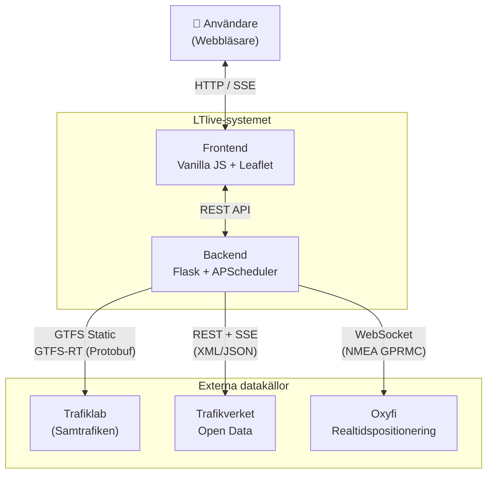

# 01 — Systemöversikt

## Syfte

LTlive visar kollektivtrafiken i Örebro i realtid. Användare ser bussar och tåg röra sig live på en interaktiv karta, kan slå upp avgångar/ankomster för hållplatser och stationer, samt spara favorithållplatser.

## Målgrupp

- **Resenärer** — ser var bussen/tåget befinner sig och när nästa avgång är
- **Trafikintresserade** — övervakar trafikflöden och förseningar
- **Utvecklare** — kan använda det öppna API:et

## Kontextdiagram

## Nyckelkoncept

| Begrepp | Beskrivning |
|---------|-------------|
| **GTFS** | General Transit Feed Specification — standardformat för kollektivtrafikdata (hållplatser, linjer, tidtabeller) |
| **GTFS-RT** | GTFS Realtime — realtidsuppdateringar: fordonspositioner, uppdaterade avgångstider, trafikstörningar |
| **SSE** | Server-Sent Events — envägs realtidsström från server till klient, används för live-uppdateringar |
| **Protobuf** | Protocol Buffers — binärt serialiseringsformat som Trafiklab använder för GTFS-RT |
| **LocationSignature** | Trafikverkets kortkod för stationer (t.ex. "Ör" = Örebro C) |

## Arkitekturstil

- **Multi-page application** — separata HTML-sidor för karta, avgångstavla, dashboard m.m.
- **In-memory stores** — all data hålls i RAM med trådsäkra lås (threading.Lock), ingen traditionell databas
- **Event-driven realtid** — SSE-strömmar med delta-uppdateringar till anslutna klienter
- **Polling-baserad datainsamling** — bakgrundsschemaläggare hämtar data med konfigurerbara intervall
- **Konfigurationsdriven** — alla parametrar styrs via miljövariabler, inga hårdkodade värden

## Vyer i applikationen

| Sida | URL | Beskrivning |
|------|-----|-------------|
| Livekarta | `/index.html` | Huvudvy med fordon, hållplatser och linjer på karta |
| Avgångstavla (buss) | `/busboard.html` | Realtidsavgångar för en vald hållplats |
| Avgångstavla (tåg) | `/trainboard.html` | Tågavgångar med Trafikverket-data |
| Dashboard | `/dashboard.html` | Översikt med fordonsantal, aktiva linjer, larm |
| Statistik | `/stats.html` | Besöksstatistik |
| Diagnostik | `/diag.html` | Systemstatus och laddningsinfo |
| Analys | `/analytics-page.html` | Förseningsanalys och trender |
