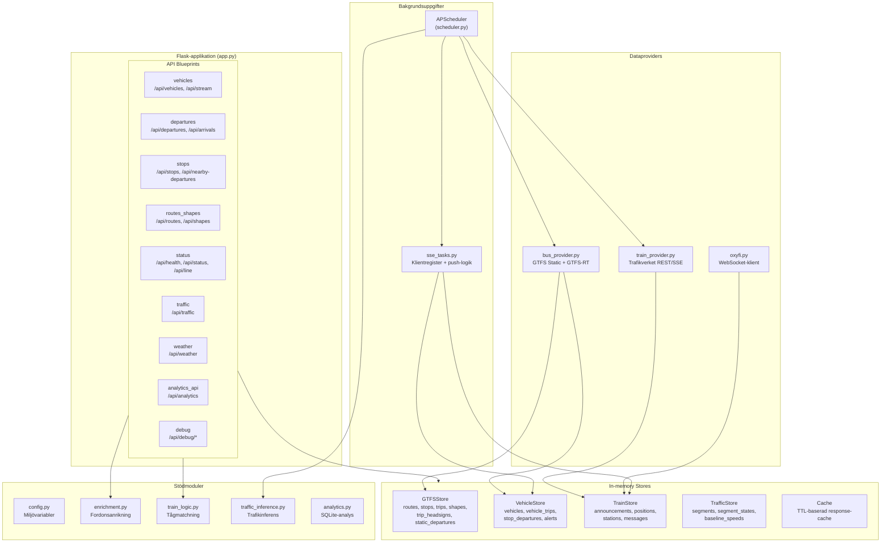
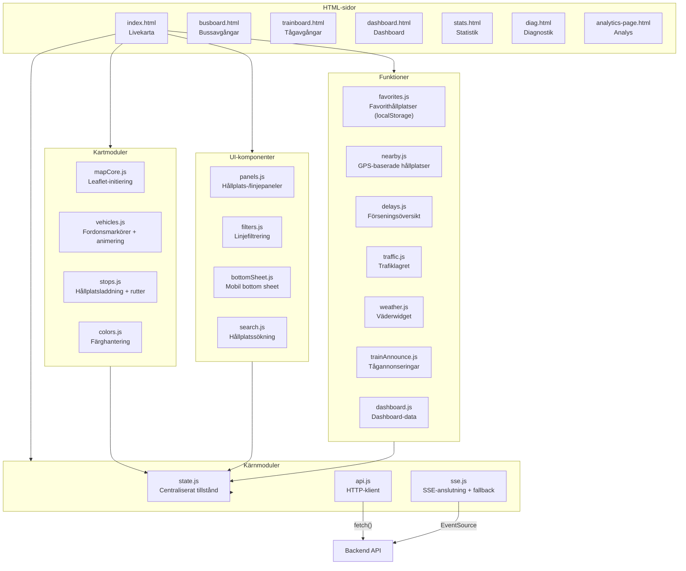

# 02 — Komponentvy

## Backend-arkitektur



### Backend-komponenter i detalj

#### API Blueprints (`backend/api/`)

| Blueprint | Fil | Endpoints | Ansvar |
|-----------|-----|-----------|--------|
| vehicles | `vehicles.py` | `/api/vehicles`, `/api/stream` | Fordonspositioner och SSE-ström |
| departures | `departures.py` | `/api/departures/<id>`, `/api/arrivals/<id>`, `/api/station-messages/<id>` | Avgångs-/ankomsttavlor med Trafikverket-anrikning |
| stops | `stops.py` | `/api/stops`, `/api/stops/stations`, `/api/stops/next-departure`, `/api/nearby-departures` | Hållplatsdata och GPS-baserad sökning |
| routes_shapes | `routes_shapes.py` | `/api/routes`, `/api/routes/trains`, `/api/routes/all`, `/api/shapes/*` | Linjer och ruttgeometrier |
| status | `status.py` | `/api/health`, `/api/status`, `/api/alerts`, `/api/line/<id>`, `/api/line-departures/<id>`, `/api/stats/*` | Hälsokontroll, konfiguration, linjeinformation, besöksstatistik |
| traffic | `traffic.py` | `/api/traffic`, `/api/traffic/summary`, `/api/traffic/monitor`, `/api/traffic/zones`, `/api/traffic/debug` | Trafikinferens-data som GeoJSON |
| weather | `weather.py` | `/api/weather` | Väderdata |
| analytics_api | `analytics_api.py` | `/api/analytics/*` | Förseningsanalys och trender |
| debug | `debug.py` | `/api/debug/*` | Diagnostik (LAN-only) |

#### Dataproviders (`backend/providers/`)

| Provider | Fil | Datakälla | Protokoll | Lagring |
|----------|-----|-----------|-----------|---------|
| bus_provider | `bus_provider.py` | Trafiklab (Samtrafiken) | HTTP + Protobuf | GTFSStore, VehicleStore |
| train_provider | `train_provider.py` | Trafikverket | REST (XML) + SSE | TrainStore |
| oxyfi | `oxyfi.py` | Oxyfi | WebSocket (NMEA GPRMC) | TrainStore |

#### In-memory Stores (`backend/stores/`)

| Store | Fil | Nyckeldata | Trådsäkerhet |
|-------|-----|------------|-------------|
| GTFSStore | `gtfs_store.py` | Linjer, hållplatser, resor, shapes, tidtabeller | `threading.Lock` |
| VehicleStore | `vehicle_store.py` | Fordonspositioner, realtidsavgångar, larm | `threading.Lock` |
| TrainStore | `train_store.py` | Tågannonseringar, GPS-positioner, stationsdata | `threading.Lock` |
| TrafficStore | `traffic_store.py` | Vägsegment, trafikstatus, baslinjer | `threading.Lock` |
| Cache | `cache.py` | TTL-baserade API-svar (4–30s) | `threading.Lock` |

---

## Frontend-arkitektur



### Frontend-moduler i detalj

#### Kärnmoduler

| Modul | Fil | Ansvar |
|-------|-----|--------|
| state | `modules/state.js` | Centraliserat applikationstillstånd — ett mutbart objekt som alla moduler importerar |
| api | `modules/api.js` | Wrappers kring `fetch()` för alla API-anrop |
| sse | `modules/sse.js` | SSE-anslutning med automatisk fallback till polling |

#### Kartmoduler

| Modul | Fil | Ansvar |
|-------|-----|--------|
| mapCore | `modules/mapCore.js` | Leaflet-kartinitiering, tile-lager (CartoDB dark/light) |
| vehicles | `modules/vehicles.js` | Fordonsmarkörer med animering, spår-rendering, popup-logik |
| stops | `modules/stops.js` | Hållplatsmarkörer, ruttlinjer, badge-uppdatering |
| colors | `modules/colors.js` | Linjefärger från GTFS med custom overrides |

#### UI-komponenter

| Modul | Fil | Ansvar |
|-------|-----|--------|
| panels | `modules/panels.js` | Paneler för hållplatsinfo, linjeinformation, fordons-popups |
| filters | `modules/filters.js` | Filterknappar per linje och filtreringslogik |
| bottomSheet | `modules/bottomSheet.js` | Dragbar bottom sheet för mobil-UI |
| search | `modules/search.js` | Hållplatssökning med autocomplete |

#### Funktionsmoduler

| Modul | Fil | Ansvar |
|-------|-----|--------|
| favorites | `modules/favorites.js` | Sparade favorithållplatser (localStorage) |
| nearby | `modules/nearby.js` | GPS-baserad "hållplatser nära mig" |
| delays | `modules/delays.js` | Översikt av mest försenade fordon |
| traffic | `modules/traffic.js` | Trafikinferenslagret på kartan |
| weather | `modules/weather.js` | Väderwidget |
| trainAnnounce | `modules/trainAnnounce.js` | Tågavgångs-/ankomsttavla |
| dashboard | `modules/dashboard.js` | Dashboard-panelens data och rendering |

### State-hantering

Frontend använder ett **centraliserat tillståndsobjekt** (`state.js`) utan ramverk:

```javascript
// state.js — förenklat exempel
export default {
    map: null,              // Leaflet-kartinstans
    vehicles: {},           // Fordonsmarkörer (vehicle_id → marker)
    stops: {},              // Hållplatsdata
    activeFilters: new Set(), // Aktiva linjefilter
    favorites: [],          // Sparade favoriter
    darkMode: true,         // Mörkt/ljust tema
    // ...
};
```

**Kommunikation mellan moduler** sker via:
- Direkt import av `state`-objektet
- Callbacks registrerade på `window._xxx` (för att undvika cirkulära beroenden)
- `app.js` fungerar som orkestrator som kopplar ihop alla moduler
