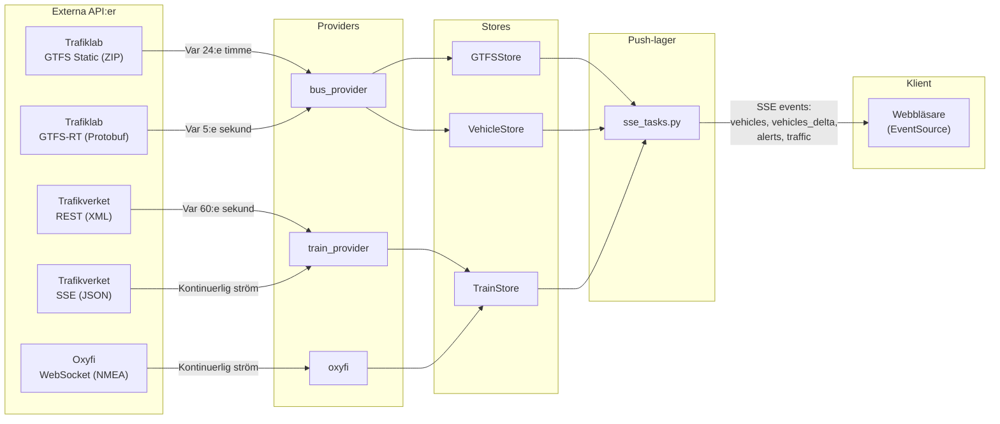
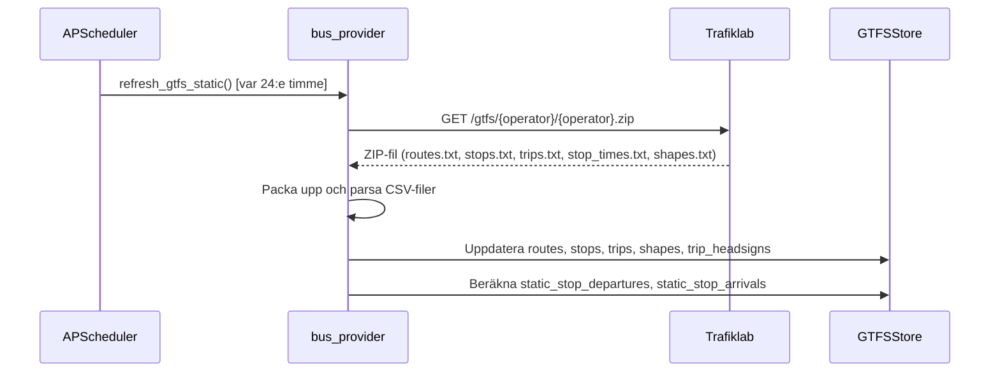
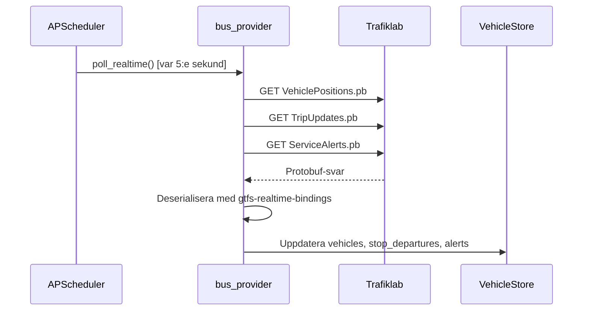
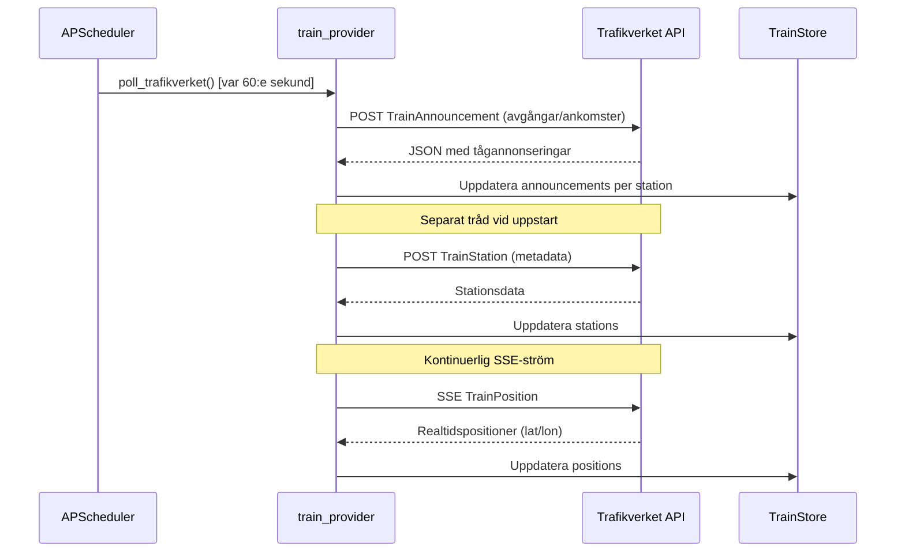
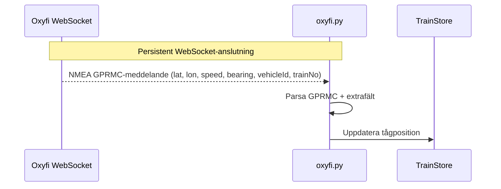
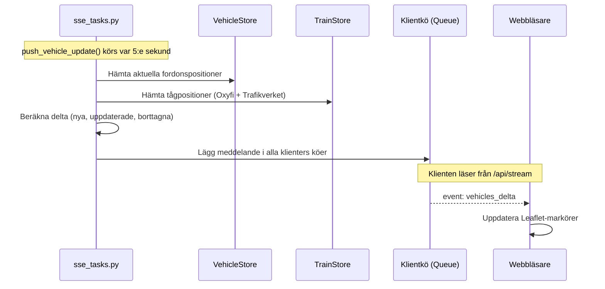
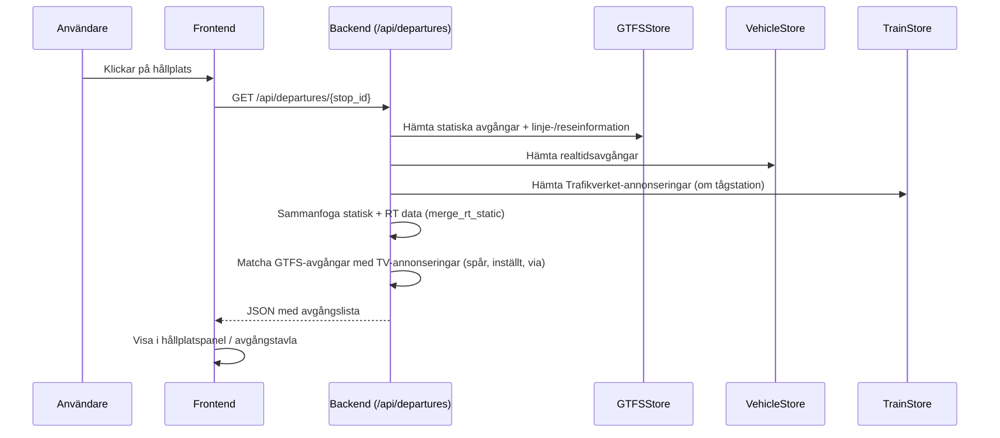

# 03 — Dataflödesvy

## Huvuddataflöde

## Buss-dataflöde

### Statisk data (GTFS Static)

### Realtidsdata (GTFS-RT)

## Tåg-dataflöde

### Trafikverket (annonseringar + positioner)

### Oxyfi (WebSocket-positioner)

## Realtidsuppdateringar till klient

### SSE Event-typer

| Event | Innehåll | Frekvens |
|-------|----------|----------|
| `vehicles` | Fullständig lista av alla fordon | Vid anslutning + periodiskt |
| `vehicles_delta` | `{updated: [...], removed: [...]}` | Var 5:e sekund |
| `alerts` | Aktiva trafikstörningar | Vid ändring |
| `traffic` | GeoJSON med trafikstatus | Periodiskt |

### Fallback-polling

Om SSE inte är tillgängligt (t.ex. proxy-problem) faller frontend tillbaka till polling av `/api/vehicles` med konfigurerbart intervall (standard 5000 ms).

## Avgångstavla-flöde

## Bakgrundsschemaläggning

| Uppgift | Funktion | Intervall | Beskrivning |
|---------|----------|-----------|-------------|
| GTFS-RT polling | `poll_realtime()` | `RT_POLL_SECONDS` (standard 5s) | Hämtar fordonspositioner, trip updates och service alerts |
| SSE-push | `push_vehicle_update()` | `RT_POLL_SECONDS` | Sammanfogar bussar/tåg och pushar till SSE-klienter |
| GTFS Static refresh | `refresh_gtfs_static()` | `GTFS_REFRESH_HOURS` (standard 24h) | Laddar ner ny GTFS-data |
| Statiska avgångar | `refresh_static_departures()` | Dagligen kl 00:01 | Laddar om dagens tidtabell |
| GTFS retry | `retry_gtfs_if_needed()` | 60s | Exponentiell backoff vid misslyckad GTFS-laddning |
| Trafikverket | `poll_trafikverket()` | `TRAFIKVERKET_POLL_SECONDS` (standard 60s) | Hämtar tågannonseringar och stationsmeddelanden |
| Trafikbaslinje | `save_baseline()` | 30 min | Sparar trafikbaslinjedata till fil |
| Dataretention | `cleanup_old_data()` | Dagligen kl 03:00 | Rensar analysdata äldre än 30 dagar |
