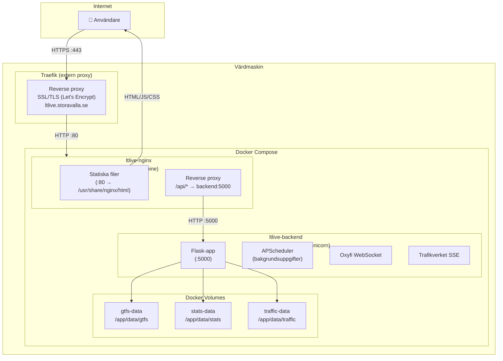

# 04 — Driftsvy

## Docker Compose-arkitektur



## Tjänster

### ltlive-backend

| Egenskap | Värde |
|----------|-------|
| Byggkontext | `./backend` |
| Container | `ltlive-backend` |
| WSGI-server | Gunicorn (1 worker, 16 trådar) |
| Intern port | 5000 |
| Volymer | `gtfs-data`, `stats-data`, `traffic-data` |
| Healthcheck | `python -c "urllib.request.urlopen('http://localhost:5000/api/health')"` |
| Restart-policy | `unless-stopped` |

### ltlive-nginx

| Egenskap | Värde |
|----------|-------|
| Image | `nginx:alpine` |
| Container | `ltlive-nginx` |
| Intern port | 80 |
| Volymer | `./frontend` (read-only), `./nginx/nginx.conf` (read-only) |
| Nätverk | `default` + `proxy` (extern, Traefik) |
| Traefik-labels | `Host(ltlive.storavalla.se)`, websecure, TLS med Let's Encrypt |
| Restart-policy | `unless-stopped` |

## Nginx-konfiguration

### Routing

| Location | Mål | Beskrivning |
|----------|-----|-------------|
| `/` | Statiska filer | Frontend HTML/JS/CSS från `/usr/share/nginx/html` |
| `/api/` | `backend:5000` | Alla API-anrop proxas till Flask |
| `/api/stream` | `backend:5000` | SSE-ström med specialkonfiguration |
| `/api/stats/` | `backend:5000` | Statistik-endpoints med egen rate limit |
| `/api/debug/` | `backend:5000` | Debug-endpoints, LAN-only |

### Rate Limiting

| Zon | Rate | Burst | Tillämpning |
|-----|------|-------|-------------|
| `api` | 60 req/min | 40 | Alla `/api/`-anrop |
| `sse` | 5 req/min | 2 | SSE-strömmen `/api/stream` |
| `stats` | 10 req/min | 5 | Statistik-endpoints |

### Säkerhetsheaders

| Header | Värde |
|--------|-------|
| `X-Content-Type-Options` | `nosniff` |
| `X-Frame-Options` | `SAMEORIGIN` |
| `Referrer-Policy` | `strict-origin-when-cross-origin` |
| `Permissions-Policy` | `geolocation=*` |
| `Content-Security-Policy` | `default-src 'self'; script-src 'self' unpkg.com; style-src 'self' unpkg.com; img-src 'self' data: *.basemaps.cartocdn.com tile.openstreetmap.org; connect-src 'self'; frame-ancestors 'none'` |

### SSE-proxy-konfiguration

SSE-strömmen kräver specialhantering i Nginx:

```nginx
proxy_buffering off;       # Inget buffertmellansteg
proxy_cache off;           # Inget cachening
proxy_read_timeout 3600s;  # 1 timme timeout
proxy_http_version 1.1;    # HTTP/1.1 för chunked transfer
```

### Debug-endpoint-skydd

Debug-endpoints är bara tillgängliga från lokalt nätverk:

```nginx
allow 10.0.0.0/8;
allow 172.16.0.0/12;
allow 192.168.0.0/16;
allow 127.0.0.1;
deny all;
```

## Cachning

### Backend-cache (in-memory TTL)

| Nyckel | TTL | Beskrivning |
|--------|-----|-------------|
| `vehicles` | 4s | Fordonspositioner |
| `next_dep` | 30s | Nästa avgång per hållplats |
| `dep` | 10s | Avgångstavla per hållplats |

### Nginx-cache (statiska filer)

| Filtyp | Cache-strategi |
|--------|----------------|
| `index.html` | `no-cache, no-store, must-revalidate` |
| `*.js`, `*.css` | `no-cache, must-revalidate` |
| Övrigt | Standard Nginx-cache |

## Hälsokontroll

Docker kör automatisk hälsokontroll:

```yaml
healthcheck:
  test: python -c "urllib.request.urlopen('http://localhost:5000/api/health')"
  interval: 30s
  timeout: 10s
  retries: 3
  start_period: 60s  # Väntar på GTFS-laddning
```

## Nätverksdiagram

```
Användare
    │
    ▼ HTTPS :443
┌──────────┐
│ Traefik  │  ← SSL-terminering (Let's Encrypt)
└──────────┘
    │ HTTP :80
    ▼
┌─────────────────────────────┐
│ Nginx (ltlive-nginx)        │
│                             │
│  /           → Statiska filer (frontend/)
│  /api/*      → proxy_pass backend:5000
│  /api/stream → SSE proxy (no buffering)
│  /api/debug/ → LAN-only → backend:5000
└─────────────────────────────┘
    │ HTTP :5000
    ▼
┌─────────────────────────────┐
│ Flask/Gunicorn (backend)    │
│  • 1 worker, 16 trådar      │
│  • APScheduler (polling)     │
│  • Oxyfi WebSocket          │
│  • Trafikverket SSE         │
└─────────────────────────────┘
    │
    ▼ Docker Volumes
┌────────────┬───────────┬──────────────┐
│ gtfs-data  │ stats-data│ traffic-data │
│ (GTFS ZIP) │ (SQLite)  │ (baseline)   │
└────────────┴───────────┴──────────────┘
```

## Miljövariabler

### API-nycklar

| Variabel | Källa | Krävs |
|----------|-------|-------|
| `TRAFIKLAB_GTFS_RT_KEY` | Trafiklab | Ja |
| `TRAFIKLAB_GTFS_STATIC_KEY` | Trafiklab | Ja (fallback: RT-nyckel) |
| `TRAFIKVERKET_API_KEY` | Trafikverket | Nej (tåg visas inte utan) |
| `OXYFI_API_KEY` | Trafiklab/Oxyfi | Nej (extra tågpositioner) |

### Kartinställningar

| Variabel | Standard | Beskrivning |
|----------|----------|-------------|
| `MAP_CENTER_LAT` | 59.2753 | Kartans centrumpunkt (lat) |
| `MAP_CENTER_LON` | 15.2134 | Kartans centrumpunkt (lon) |
| `MAP_DEFAULT_ZOOM` | 13 | Standard zoomnivå |
| `NEARBY_RADIUS_METERS` | 400 | Radie för "nära mig"-sökning |

### Pollningsintervall

| Variabel | Standard | Beskrivning |
|----------|----------|-------------|
| `RT_POLL_SECONDS` | 5 | GTFS-RT pollningsfrekvens |
| `GTFS_REFRESH_HOURS` | 24 | Statisk GTFS-uppdatering |
| `TRAFIKVERKET_POLL_SECONDS` | 60 | Trafikverket-pollning |
| `FRONTEND_POLL_INTERVAL_MS` | 5000 | SSE fallback-polling (frontend) |

### Operatörskonfiguration

| Variabel | Standard | Beskrivning |
|----------|----------|-------------|
| `OPERATOR` | orebro | Trafiklab-operatör |
| `TZ` | Europe/Stockholm | Tidszon |
| `TIB_AGENCY_ID` | *(tom)* | Tåg i Bergslagen agency-filter |
| `TIB_ROUTE_SHORT_NAMES` | *(tom)* | Kommaseparerade linjenamn |
| `TRAFIKVERKET_STATIONS` | *(tom)* | Mapping GTFS stop_id → LocationSignature |
